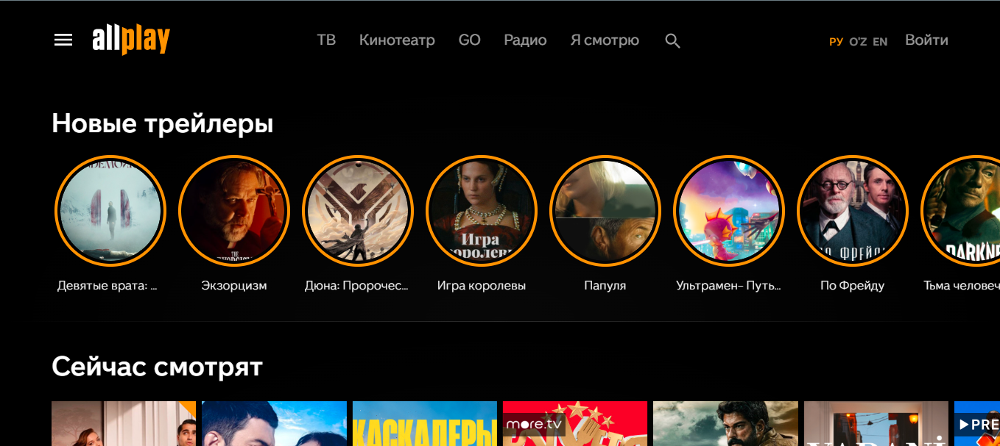
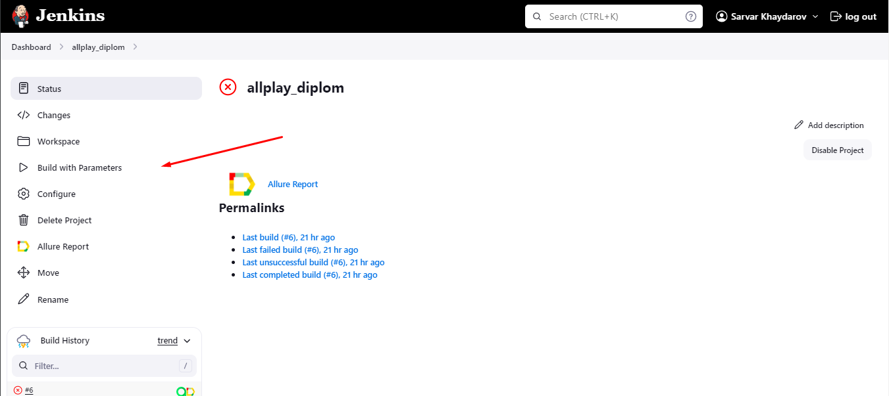
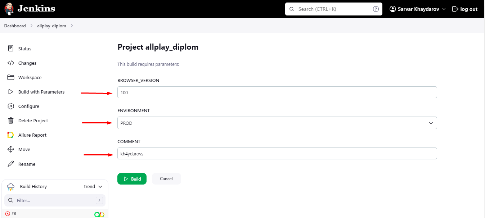
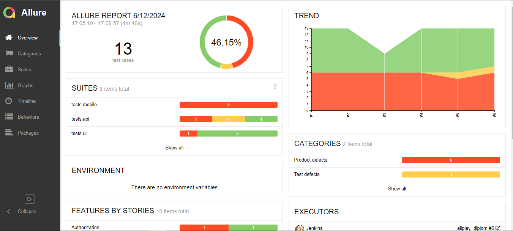
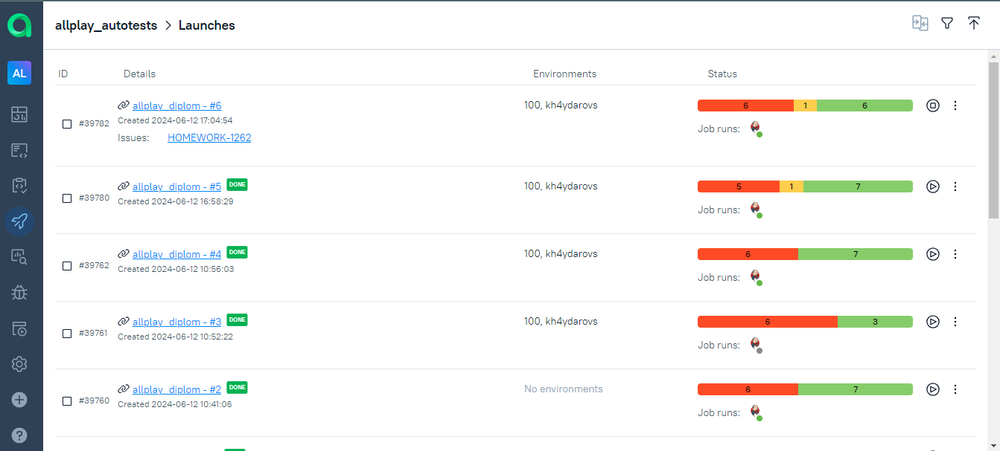
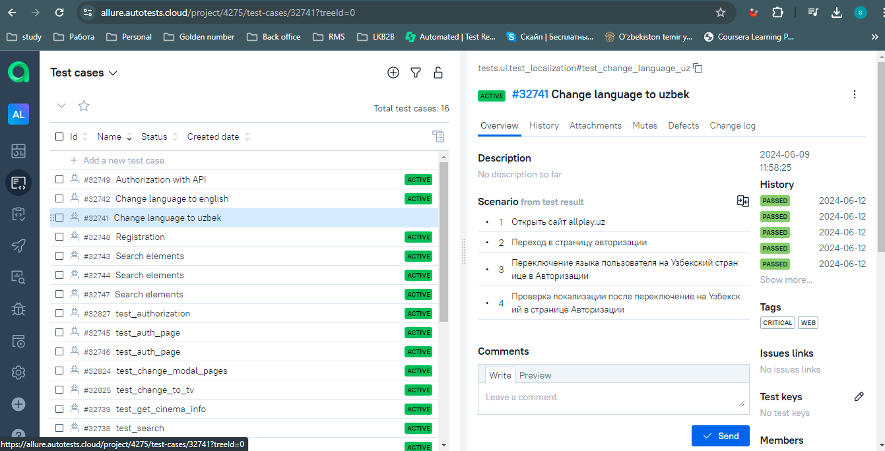
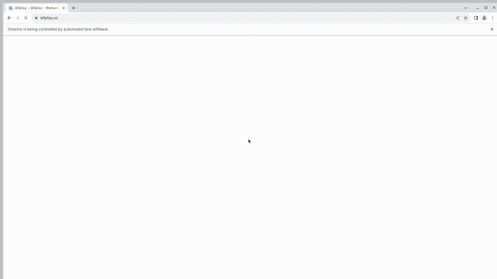

<h1 align="center">Фреймворк для автоматизации тестирование онлайн кинотеатра Allplay"</h1>

  

***
***Особенности проекта***  
-Оповещения о тестовых прогонах в Telegram  
-Отчеты с видео, скриншотом, логами, исходной моделью разметки страницы  
-Сборка проекта в Jenkins  
-Отчеты Allure Report  
-Интеграция с Allure TestOps
-Запуск web/UI автотестов в Selenoid.

***
***Список проверок, реализованных в web/UI автотестах***

-Проверка регистрации на сайте   
-Вход в сайт с зарегестрированными данными     
-Переход в раздел ТВ по кнопке который находиться в шапке сайта  
-Переход в раздел Кинотеатр по кнопке   
-Поиск определленого фильма по называнию и   переход на карточку фильма    

***

***Используемый стэк***  

***  
***Запуск тестов***  
---

<h2 id="run-tests"> Run tests</h2>

<b>For web tests:</b>

<pre>
    pytest tests/ui
</pre>

<b>For API tests:</b>

<pre>
    pytest tests/api
</pre>

<b>For mobile tests on emulator:</b>

<pre>
    pytest tests/mobile --context=local_emulator
</pre>

<b>For mobile tests on bstack:</b>

<pre>
    pytest tests/mobile --context=bstack
</pre>

---

To run tests in Jenkins you need to click on <b>Build with Parameters</b> button

Сhoose parameters (<i>BROWSER_VERSION, ENVIRONMENT, COMMENT</i>) and click on <b>"Build"</b> button

After passing the tests report will be generated, you can see it by clicking on the <b>Allure report</b> and <b>Allure TestOps</b>

<a href="https://allure.autotests.cloud/project/4275/dashboards">TestOps</a>

Project in Jira

---

---

***Видео прохождение UI автотестов*** 

  

***